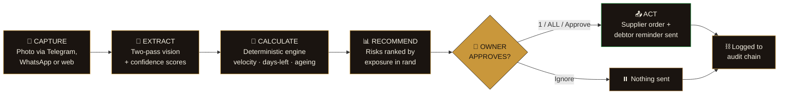
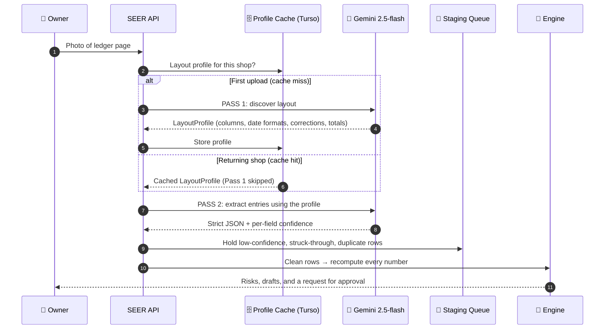
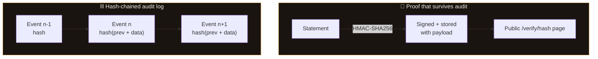
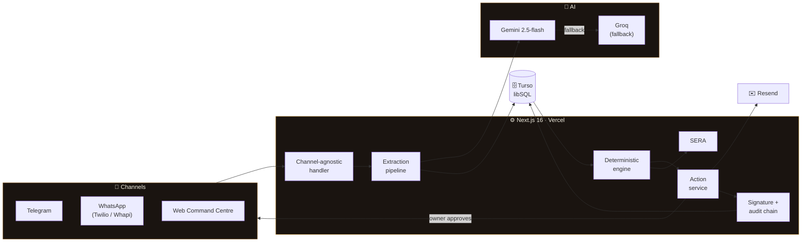

<!-- ═══════════════════════════════════════════════════════════════════
     SEER · Small Enterprise Early-Warning & Response
     "Paper in. Decisions out."
     ═══════════════════════════════════════════════════════════════════ -->

<div align="center">


<!-- Drop your logo at assets/seer-logo.png (the laurel-crowned profile from the project PDF) -->


<br/>

<a href="https://seer-silk.vercel.app">
  
</a>

<br/><br/>

[](https://seer-silk.vercel.app)
[](https://t.me/seer_demo_bot)
[](#-the-event)


<!-- Live repo activity (auto-updating) -->


<br/>

### *The AI reads and explains. The code calculates. The owner decides.*

</div>

---

## 📖 Contents

<table>
<tr>
<td valign="top" width="33%">

**The Story**
- [⚡ At a Glance](#-at-a-glance)
- [🧨 The Problem](#-the-problem)
- [🔮 What SEER Does](#-what-seer-does)
- [💰 The Headline Metric](#-the-headline-metric)
- [🎯 Use Cases](#-use-cases)

</td>
<td valign="top" width="33%">

**The Product**
- [🖥️ Live Command Centre](#️-live-command-centre)
- [💬 Chat Commands](#-chat-commands)
- [👁️ Extraction Pipeline](#️-the-extraction-pipeline)
- [🧮 Decision Engine](#-the-decision-engine)
- [🗣️ SERA](#️-sera--the-conversational-analyst)

</td>
<td valign="top" width="33%">

**The Engineering**
- [🏗️ Architecture](#️-architecture)
- [🔐 Trust & Security](#-trust--security)
- [🗂️ Repository Layout](#️-repository-layout)
- [🚀 Run It Yourself](#-run-it-yourself)
- [🗺️ Roadmap](#️-roadmap)
- [👥 Team](#-team)

</td>
</tr>
</table>

---

## ⚡ At a Glance

<div align="center">

| 📸 | 🧠 | 🧮 | ✅ |
|:---:|:---:|:---:|:---:|
| **Capture** | **Extract** | **Calculate** | **Approve & Act** |
| Photograph a handwritten ledger page in Telegram or the web app | Two-pass vision pipeline turns ink into structured, confidence-scored data | Deterministic TypeScript computes every number. No model arithmetic | Supplier orders and debt reminders are drafted. Sent only on a tap or a `1` |

</div>

> [!IMPORTANT]
> **Reviewing this project?** Open **[seer-silk.vercel.app](https://seer-silk.vercel.app)**. No login, no setup. The dashboard opens on a loaded demo business and every number is inspectable. Click any risk to open its *"Why this number?"* drawer with the formula and inputs.

---

## 🧨 The Problem

Small township retailers (spaza shops, tuck shops, taverns, general dealers) run **stock, credit and supplier records in paper notebooks**. Problems only surface after the money is already gone:

<div align="center">

| 🥛 The shelf is empty at peak hour | 📒 A debt is 18 days overdue | 🚚 A supplier silently misses delivery |
|:---:|:---:|:---:|
| Sales are lost the moment the shelf clears | Recovery odds drop sharply with age | Orders were placed from memory anyway |

</div>

Three failure modes drain working capital again and again:

1. **Stockouts.** Fast movers run out because sell-through speed is invisible on paper.
2. **Unchased credit (*makhaza*).** Balances pile up unwatched until recovery is unrealistic.
3. **Reactive purchasing.** Cash gets locked in slow stock while fast stock depletes.

> The real cost isn't bookkeeping time. It's the **compounded revenue lost to late decisions.** SEER attacks the delay, not just the notebook.

### 🧪 Deliberately hard inputs

SEER was tested on ledgers that fight back, not clean spreadsheets:

<details>
<summary><b>See what the pipeline has to survive</b></summary>

<br/>

| Mess in the ledger | What SEER does about it |
|---|---|
| Wrong additions and overwritten totals | Recomputes independently, flags the discrepancy |
| Smudged digits, faded ballpoint | Per-field confidence; low-confidence fields held for review |
| Duplicate invoices recorded twice | Detected and rejected at ingestion |
| Personal spending mixed with business expenses | Separated, not counted as shop cost |
| Whole-month bills | Prorated across days |
| Airtime and electricity pass-throughs | Recognised as *not* shop income |
| Margin notes in a second pen colour | Treated as annotations, not entries |
| Struck-through lines with corrections beside them | Held in the staging queue for owner confirmation |

</details>

---

## 🔮 What SEER Does

A closed-loop, five-step decision cycle in which **the owner keeps total control.**



### The three-part contract

| Role | Who | Responsibility |
|:---:|:---:|---|
| 👁️ **Reads & explains** | The vision / language model | Interprets handwriting, explains risks in plain language. **Never does arithmetic.** |
| 🧮 **Calculates** | Deterministic TypeScript | Every figure is recomputed from source data. Reproducible and auditable. |
| 👤 **Decides** | The shop owner | Every message and order needs explicit approval. |

---

## 💰 The Headline Metric

$$\text{Exposure Prevented} = \text{Projected Loss Without Intervention} - \text{Projected Loss With Intervention}$$

<div align="center">

### **R 2 102** &nbsp;prevented over a 7-day window *(default seed business)*

| Risk | Category | Exposure Prevented |
|---|:---:|---:|
| 🌽 Maize meal 5 kg stockout | Stockout | **R 910** |
| 🥛 Milk 2 L stockout | Stockout | **R 682** |
| 📒 Dlamini overdue | Receivable | **R 510** |
| | **Total** | **R 2 102** |

</div>

To rule out ambiguity, every financial figure in the product carries an explicit data-honesty badge:

| Badge | Meaning |
|:---:|---|
| 🟢 **Measured** | Read directly from the owner's pages |
| 🔵 **Calculated** | Derived deterministically from measured data |
| 🟠 **Projected** | A forward estimate, shown as such |

---

## 🎯 Use Cases

| Scenario | What SEER does |
|---|---|
| 🥛 **Stockout warning** | Milk runs out in **31 hours**. The supplier needs **2 days**. SEER recalculates the reorder to **38 cartons** and drafts the supplier message. |
| 📒 **Overdue receivable** | Dlamini owes **R850**, **18 days** overdue. SEER drafts a polite reminder, with recovery probability factored into exposure. |
| 🧾 **Messy ledger** | A page with wrong arithmetic and a duplicate invoice. SEER flags the discrepancy, rejects the duplicate, holds low-confidence fields for review. |
| 🚚 **Supplier delay** | The dairy pushes delivery by 3 days. Lead time becomes 5, the uncovered gap grows, and the reorder recalculates. |
| 🎉 **Demand spike** | Owner says a Saturday event is coming. Expected demand rises 60% and reorder quantities update. |
| 📑 **Weekly report** | A signed PDF statement: income, balance sheet, schedules and an HMAC-SHA256 hash. |
| 💬 **Conversational query** | The owner asks **SERA** a question; she reads the same live data and answers in plain language. |

### Who it serves

| Audience | What they get |
|---|---|
| 🏪 **Spaza & tavern owners** | A daily brief on WhatsApp or Telegram that ranks risks, drafts messages, and needs only a `1` to approve |
| 🛒 **Small general dealers** | Aged debtors ranked by recovery probability, with follow-up drafts ready |
| 📚 **Accountants & bookkeepers** | Signed PDF statements that reconcile to source pages and can be publicly verified |
| ⚖️ **Judges & reviewers** | A live command centre on a loaded demo business, with every number traceable |
| 👩‍💻 **Developers** | A TypeScript codebase with a two-pass extraction pipeline, deterministic engine and swappable AI providers |

---

## 🖥️ Live Command Centre

> **[seer-silk.vercel.app](https://seer-silk.vercel.app)** · no login · refreshes from a live activity stream every **2 seconds**

Upload a page and, within seconds, the numbers change on screen: risks recompute, actions queue, the audit chain grows.

| Tab | What you'll see |
|---|---|
| 🏠 **Overview** | Exposure Prevented, *Act Today* cards, live activity feed |
| ⚠️ **Risk Matrix** | Ranked risks, each with a **Why this number?** drawer showing the formula and its inputs |
| ⚡ **Action Hub** | Pending and approved actions with message and purchase-order previews |
| 📈 **Projections** | 90-day revenue trend, category mix, day-of-week pattern, 7-day forecast, anomaly detection, SERA analysis |
| 🧪 **7-Day Simulation** | Assumption sliders and a one-click **Inject Business Shock** button |
| 🔍 **OCR Audit Logs** | The original page beside every extracted field, with confidence badges |
| ⛓️ **Audit Chain** | An HMAC-chained, tamper-evident log of every extraction and approval |
| 🗣️ **SERA Chat** | Ask the analyst anything about the business |

### 🔗 Live endpoints

| Service | Link |
|---|---|
| 🖥️ **Command Centre** | [seer-silk.vercel.app](https://seer-silk.vercel.app) |
| 🤖 **Telegram Bot** | [@seer_demo_bot](https://t.me/seer_demo_bot) |
| 📄 **Signed Statement** | `https://seer-silk.vercel.app/api/statements/<hash>` |
| ✅ **Public Verification** | `https://seer-silk.vercel.app/verify/<hash>` |

---

## 💬 Chat Commands

No app to install, no sign-up. Every reply is plain text formatted for a mobile screen.

| You send | SEER replies with |
|---|---|
| `hello` | A short greeting and the command list |
| `today` | The top three risks and their reasons |
| `stock` | Every tracked product with days-left and urgency |
| `owed` | Debtors, grouped by name and aged |
| `report` | A 7-day summary with Exposure Prevented |
| `statement` | A signed PDF statement link |
| `csv` | Four export links for Excel / Google Sheets |
| `review` | Any rows held back from the last upload |
| `1`, `2`, `ALL` | Approves specific or all pending actions |
| 📷 *photo(s)*, then `done` | Extraction summary and confirmations |

<details>
<summary><b>💡 A typical morning, as a chat</b></summary>

<br/>

```text
Owner  ▸ today

SEER   ▸ Top 3 risks today
         1. Maize meal 5 kg: stockout risk (R910 exposure)
         2. Milk 2 L: runs out in 31h, supplier needs 2 days (R682)
         3. Dlamini: R850 is 18 days overdue (R510)

         Pending actions:
         [1] Order from supplier
         [2] Reminder to Dlamini
         Reply 1, 2 or ALL to approve.

Owner  ▸ ALL

SEER   ▸ Done. 2 actions approved and sent. Logged to audit chain.
```

*(Illustrative transcript; exact wording is generated per business.)*

</details>

---

## 👁️ The Extraction Pipeline

**Two passes, one cache.** SEER learns each shop's ledger format once, then gets faster every time.



### Pass 1: Layout Discovery
Gemini is shown the page and describes its structure:

- How many columns exist and what each contains
- How dates are written (`28/09`, `28-09`, `Sept 28`…)
- Where corrections and struck-through lines appear
- Where the totals live
- What the header says (business name, owner, date)

The result is a reusable JSON **`LayoutProfile`**, cached per shop in Turso.

### Pass 2: Entry Extraction
Gemini receives the page **and** the profile, and extracts every entry with a confidence score per field:

```json
{
  "products": [
    { "name": "Milk 2L", "quantity": 6, "unit": "each", "price": 22, "confidence": 0.94 }
  ],
  "sales": [],
  "expenses": [],
  "receivables": [
    { "customerName": "Dlamini", "amount": 850, "dueDate": "2026-09-10", "confidence": 0.88 }
  ]
}
```

### 🛂 The staging queue
SEER never guesses. These are **held back for the owner to confirm**:

- ⚠️ Low-confidence fields
- ✂️ Struck-through lines
- 👯 Duplicate invoices

### Resilience
- **Exponential backoff and retry** around every model call
- **Automatic LLM fallback** to Groq if Gemini is unavailable
- **Raw OCR transcription fallback** module for hard pages
- **Multi-page documents** supported

---

## 🧮 The Decision Engine

Deterministic TypeScript. No model arithmetic, ever. Same inputs, same outputs, every time.

| Computes | Purpose |
|---|---|
| **Daily sales velocity** | How fast each product actually moves |
| **Days of stock remaining** | Time until the shelf is empty |
| **Reorder triggers & quantities** | When and how much to order, given supplier lead time |
| **Credit ageing** | How overdue each debtor is |
| **Recovery probability** | How likely a debt is to be recovered, given its age |
| **Exposure** | Rand value at risk, used to rank everything |

<details>
<summary><b>🔬 Illustrative logic behind the <i>"Why this number?"</i> drawer</b></summary>

<br/>

```text
days_left      = stock_on_hand ÷ daily_velocity
uncovered_gap  = max(0, supplier_lead_time − days_left)
exposure       = uncovered_gap × daily_velocity × unit_margin
```

Every risk card exposes its real formula and the exact inputs, so the owner (or a judge) can check the arithmetic by hand.

*Simplified for illustration; see `src/lib/engine.ts` for the source of truth.*

</details>

Risks are **ranked by exposure value** and explained in plain language, so the owner sees the biggest rand risk first.

---

## 🗣️ SERA: The Conversational Analyst

**SERA** is SEER's built-in business analyst. She reads the **same live data** the dashboard does and answers in plain language, inside strict guardrails:

- ✅ Explains risks, trends and what-ifs from real records
- ✅ Never invents a number, because she reads what the engine computed
- 🚫 Compliance and advisory guardrails: she refuses what she shouldn't answer

---

## ⛓️ Trust & Security

> **Trust by construction.** The owner doesn't have to trust the AI, and the AI cannot fabricate a number.



| Layer | Protection |
|---|---|
| ✋ **Approval gate** | No message or order leaves the system without explicit owner approval |
| ✍️ **HMAC-SHA256 signatures** | Every statement is signed. Edit a single figure and the signature breaks. Verifiable by anyone via `/verify/[hash]` |
| ⛓️ **Hash chain** | Every extraction, approval and correction is chained to the one before it. Rewriting history breaks the chain from the change point forward |
| 🔑 **Dev-mode security** | Dynamic time-based passcode, 3-attempt lockout, allowlisted Telegram chat IDs only |
| 🛡️ **SSRF guard** | Media fetches restricted to allow-listed provider hosts, with size caps |
| 🔁 **Message dedup** | Every inbound message is hashed and checked before processing |
| 🇿🇦 **POPIA-aware** | Only customer names and debts stored. Minimum personal data, consented only |
| 🧮 **No model arithmetic** | The engine recomputes every number independently |

---

## 🏗️ Architecture



### Production stack

| Layer | Choice | Notes |
|---|---|---|
| **Frontend & API** | Next.js 16 (App Router) | Serverless, edge-ready, Turbopack builds |
| **Language** | TypeScript 5.4 | Type-safe deterministic engine |
| **Database** | Turso (distributed libSQL) | Local SQLite in dev, hosted in production |
| **Vision & language** | Google Gemini `gemini-2.5-flash` | Multimodal extraction and natural-language interaction |
| **LLM fallback** | Groq API | Automatic gateway if Gemini is unavailable |
| **Primary channel** | Telegram Bot API | Production channel |
| **WhatsApp adapters** | Twilio, Whapi Cloud | Alternative transports |
| **Email** | Resend | Free tier, 100 emails/day, no credit card |
| **Signing** | HMAC-SHA256 (`node:crypto`) | Zero external dependencies |
| **Hosting** | Vercel | Zero-cost deploys, serverless functions |

<div align="center">

### 💸 Total running cost: **R0**
*No subscriptions. No credit card. No trial that expires.*
Gemini free tier · Telegram free Bot API · Vercel free tier · hosted SQLite

</div>

---

## 🗂️ Repository Layout

<details open>
<summary><b>Core library: <code>src/lib/</code></b></summary>

<br/>

| File | Purpose |
|---|---|
| `engine.ts` | Core decision engine: formulas and single-query risk evaluation |
| `layout.ts` | Two-pass layout discovery, prompts and extraction schemas |
| `profile-store.ts` | Per-shop layout profile store backed by Turso |
| `extraction.ts` | Unified pipeline connecting discovery and line-item parsing |
| `ocr.ts` | Raw vision transcription fallback |
| `ai.ts` | Gemini SDK wrapper with exponential backoff and retry |
| `ingest.ts` | Transactional ingestion: date normalisation, deduplication, provenance tracking |
| `signature.ts` | HMAC-SHA256 signing for financial statements |
| `chain.ts` | Append-only, tamper-evident hash-chained audit log |
| `sera.ts` | SERA, with compliance and advisory guardrails |
| `statement-pdf.ts` | 4-page signed statement engine (Income Statement, Balance Sheet, Risk Schedules) |
| `handler.ts` | Channel-agnostic inbound message router |
| `channels.ts` | Messaging adapters for Telegram, WhatsApp and Email |
| `security.ts` | IP/dev allowlists, dynamic TOTP lockout, SSRF protection, message dedup |
| `dev.ts` | Developer Control Center CLI handler (`chat ovrd`, seed, reset, wipe) |
| `db.ts` | Central `@libsql/client` instance and async query helpers |
| `migrations.ts` | Idempotent database migration harness |
| `email.ts` | Resend wrapper with demo-redirect support |
| `actions.ts` | Action lifecycle: approve, personalise, execute, settle |
| `activity.ts` | Single activity stream every subsystem writes to |

</details>

<details>
<summary><b>App, components & scripts</b></summary>

<br/>

| Path | Purpose |
|---|---|
| `src/app/api/*` | Serverless routes: state, statements, audit chain, SERA, webhooks, data exports |
| `src/app/verify/[hash]/` | Public cryptographic signature verification |
| `src/app/page.tsx` | Command Centre dashboard |
| `src/components/*` | Overview, Risks, Actions, Records, Simulation, Upload, SERA Chat, Audit Chain, ScanAnimation |
| `scripts/*` | Database seeding, schema migration, system diagnostics |

</details>

---

## 🚀 Run It Yourself

### Prerequisites
- Node.js 20+
- A free [Gemini API key](https://aistudio.google.com/apikey)

### Quick start

```bash
# 1 · Clone
git clone https://github.com/vna-07/THE-SEER.git
cd THE-SEER

# 2 · Install
npm install
cp .env.example .env.local

# 3 · Add GEMINI_API_KEY and SIGNING_SECRET to .env.local
#     Generate a signing secret:
node -e "console.log(require('crypto').randomBytes(32).toString('hex'))"

# 4 · Migrate, seed, run
npm run db:migrate
npm run db:seed
npm run dev
```

Open **http://localhost:3000**. The dashboard loads with the demo business and **R2 102** of Exposure Prevented. The full stack runs offline with seed data.

### 🔧 Environment variables

| Variable | Required | Purpose |
|---|:---:|---|
| `GEMINI_API_KEY` | ✅ | Vision and language (free tier is enough) |
| `SIGNING_SECRET` | ✅ | HMAC-SHA256 key for statements and the audit chain |
| `TURSO_DATABASE_URL` / `TURSO_AUTH_TOKEN` | production | Hosted libSQL (local SQLite is used in dev) |
| `GROQ_API_KEY` | optional | LLM fallback if Gemini is unavailable |
| `TELEGRAM_BOT_TOKEN` | optional | Enables the Telegram channel |
| `RESEND_API_KEY` | optional | Enables email delivery |

> [!NOTE]
> The first two are confirmed by the project docs. Check the rest against `.env.example` before publishing, in case names differ.

### 📜 Available scripts

| Command | What it does |
|---|---|
| `npm run dev` | Start the dev server |
| `npm run db:migrate` | Apply idempotent schema migrations |
| `npm run db:seed` | Load the demo business |

### ☁️ Deployment

1. Push to GitHub and import the repo into **Vercel**
2. Provision a **Turso** database and add its URL and token
3. Set `GEMINI_API_KEY`, `SIGNING_SECRET` and any channel keys as Vercel env vars
4. Point the Telegram webhook at your deployment's webhook route

Everything fits inside free tiers.

---

## 🗺️ Roadmap

The prototype is **deliberately narrow**: two risk types, one end-to-end flow, one chat channel, one language. Next:

- [ ] 🎙️ **Voice notes**: many owners prefer speaking to typing
- [ ] 🗣️ **isiXhosa & Afrikaans templates**, written and proofread by native speakers
- [ ] 🌅 **Proactive briefs**: a morning summary and automatic overdue nudges
- [ ] ⏱️ **Measured lead times**: replace promised delivery times with each supplier's real record
- [ ] 💳 **Repayment tracking**: flag customers who shouldn't be extended further credit
- [ ] ✏️ **Correction by chat**: *"Milk was 24, not 42"* updates the record and logs to the audit chain
- [ ] 🤝 **Pooled procurement**: several spazas ordering together for better prices

---

## 🏆 The Event

<div align="center">

**DevSoc Hackathon 2026** · *"Intelligence for Tomorrow"*
**Track 5: AI & Automation** (with elements of Track 1 Business Ops, Track 2 Finance & Admin and Track 4 Data & BI)
Rhodes University · Hamilton Building · Makhanda, Eastern Cape, South Africa
2 – 4 October 2026

*Department of Computer Science & Department of Information Systems*

</div>

---

## 👥 Team

<div align="center">

<table>
<tr>
<td align="center" width="50%" valign="top">

### Ayolela M. M. Vena
**Technical Lead**

Core decision engine · two-pass vision pipeline · channel routing (Telegram/WhatsApp) · Turso + Vercel deployment · deterministic calculation correctness · HMAC-SHA256 statement signing · hash-chained audit log · dynamic TOTP dev authentication

[](https://github.com/vna-07)

</td>
<td align="center" width="50%" valign="top">

### Inga Jikijela
**Business & Product Lead**

Trader interviews and ground-truth timing metrics · financial impact model · launch roadmap · Command Centre UX choreography · pitch narrative · written audit statements · PCR/SPL optimisation · system stress testing

</td>
</tr>
</table>

*Both members contributed equally to problem formulation, impact modelling, domain stress-testing and the live presentation.*

</div>

---

## 📄 License

Released under the **MIT License**.

---

<div align="center">

### *We don't digitise the notebook.*
### ***We turn paper into decisions.***

**SEER** · Paper in. Decisions out.
*Every number traceable. Every message approved. Every statement signed.*

<br/>


</div>
